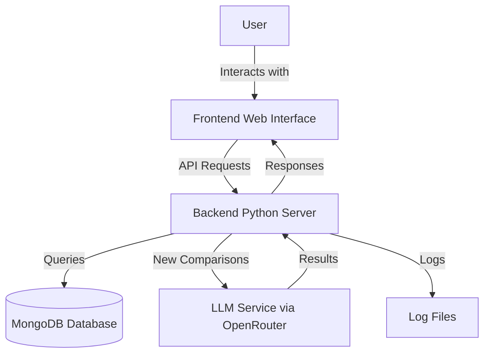

# WhatBeats

[](https://opensource.org/licenses/MIT)
[](https://www.docker.com/)
[](https://www.mongodb.com/)
[](https://fastapi.tiangolo.com/)

A creative game where players suggest items that beat the current item, judged by an LLM based on real-world properties and interactions.

## 📋 Table of Contents

- [Overview](#overview)
- [Features](#features)
- [Installation](#installation)
  - [Manual Setup](#manual-setup)
  - [Docker Setup](#docker-setup)
- [Usage](#usage)
  - [For Players](#for-players)
  - [For Administrators](#for-administrators)
- [Project Structure](#project-structure)
- [Architecture](#architecture)
- [Documentation](#documentation)
- [Contributing](#contributing)
- [License](#license)
- [Acknowledgments](#acknowledgments)

## 🎮 Overview

WhatBeats is a game where players suggest items that beat the current item. The game starts with "rock", and players suggest items that would beat rock in a real-world interaction. An LLM (Large Language Model) judges whether the suggested item would beat the current item based on physical properties, chemical reactions, natural interactions, and logical cause-and-effect relationships.

The goal is to create the longest chain of items possible, with each new item beating the previous one. How far can you go?

## ✨ Features

- **Intuitive Gameplay**: Simple interface for suggesting items that beat the current one
- **LLM-Powered Judging**: Advanced AI determines if your suggestion beats the current item
- **Score Tracking**: Keep track of your highest scores and compete with others
- **Game History**: View the chain of items from your game session
- **Statistics**: Explore common comparisons and high scores
- **Admin Interface**: Manage the game, review reports, and update comparisons
- **Security Features**: Protection against common web vulnerabilities
- **Docker Support**: Easy deployment with Docker and Docker Compose

## 🚀 Installation

### Manual Setup

#### Prerequisites

- Python 3.9+
- Node.js and npm
- MongoDB 6.0+

#### Steps

1. **Clone the repository**

```bash
git clone https://github.com/yourusername/whatbeats.git
cd whatbeats
```

2. **Set up environment variables**

```bash
cp .env.example .env
./generate_secrets.sh
```

3. **Run the application**

```bash
./run.sh
```

This script will:
- Check if MongoDB is running and start it if needed
- Create and activate a Python virtual environment
- Install Python dependencies
- Install frontend dependencies
- Start the backend server
- Start the frontend server
- Open the application in your web browser

### Docker Setup

#### Prerequisites

- [Docker](https://docs.docker.com/get-docker/)
- [Docker Compose](https://docs.docker.com/compose/install/)

#### Steps

1. **Clone the repository**

```bash
git clone https://github.com/yourusername/whatbeats.git
cd whatbeats
```

2. **Set up environment variables**

```bash
cp .env.example .env
./generate_secrets.sh
```

3. **Build and run with Docker Compose**

```bash
docker-compose up -d
```

This will:
- Start a MongoDB container
- Build and start the WhatBeats application container
- Make the application available at:
  - Frontend: http://localhost:3000
  - Backend API: http://localhost:8000

4. **View logs**

```bash
docker-compose logs -f
```

5. **Stop the application**

```bash
docker-compose down
```

## 📝 Usage

### For Players

1. **Start a Game**
   - Visit the application at http://localhost:3000
   - Click "Start Game" to begin a new game session
   - The game starts with "rock" as the initial item

2. **Play the Game**
   - Enter what you think beats the current item in the input field
   - Submit your answer
   - If your answer beats the current item:
     - Your score increases
     - The game continues with your answer as the new current item
   - If your answer doesn't beat the current item:
     - The game ends
     - Your final score and item chain are displayed

3. **View Statistics**
   - Click on the "Stats" button to view:
     - Common comparisons and their outcomes
     - High scores from all players

### For Administrators

1. **Access the Admin Interface**
   - Visit http://localhost:3000/admin.html
   - Log in with your admin credentials

2. **Manage Reports**
   - Review reports submitted by users
   - Update the status of reports (open, resolved, rejected)

3. **Update Comparisons**
   - Correct incorrect comparisons
   - Add new known relationships to the system

4. **View System Statistics**
   - Monitor game usage
   - Track high scores and popular comparisons

## 📁 Project Structure

```
whatbeats/
├── backend/               # Backend Python code
│   ├── app/               # FastAPI application
│   │   ├── __init__.py
│   │   ├── auth.py        # Authentication logic
│   │   ├── database.py    # Database service
│   │   ├── game_service.py # Game logic
│   │   ├── llm_service.py # LLM integration
│   │   ├── main.py        # FastAPI app and endpoints
│   │   ├── models.py      # Data models
│   │   └── report_service.py # Report handling
│   └── run.py             # Backend entry point
├── frontend/              # Frontend web interface
│   ├── admin.html         # Admin interface
│   ├── admin.js           # Admin functionality
│   ├── api.js             # API client
│   ├── app.js             # Main application logic
│   ├── index.html         # Main game interface
│   ├── login.html         # Login page
│   ├── package.json       # Frontend dependencies
│   ├── server.js          # Static file server
│   ├── styles.css         # CSS styling
│   └── utils.js           # Utility functions
├── docs/                  # Documentation
├── .dockerignore          # Docker ignore file
├── .env.example           # Example environment variables
├── .gitignore             # Git ignore file
├── docker-compose.yml     # Docker Compose configuration
├── Dockerfile             # Docker configuration
├── generate_secrets.sh    # Script to generate secrets
├── README.md              # This file
├── requirements.txt       # Python dependencies
└── run.sh                 # Application launcher script
```

## 🏗️ Architecture

WhatBeats follows a client-server architecture with the following main components:



### Technology Stack

- **Frontend**: HTML, CSS, JavaScript
- **Backend**: FastAPI (Python)
- **Database**: MongoDB
- **LLM Integration**: OpenAI-compatible API via OpenRouter
- **Deployment**: Docker, Docker Compose

For more details on the architecture, see the [Architecture Documentation](docs/architecture.md).

## 📚 Documentation

Comprehensive documentation is available in the `/docs` directory:

- [Architecture Overview](docs/architecture.md) - High-level architecture, technology stack, and database schema
- [Frontend Documentation](docs/frontend.md) - Frontend implementation details, setup instructions, and features
- [Backend Services](docs/backend.md) - Backend services, API endpoints, and configuration
- [Game Flow Sequence](docs/game_flow_sequence.md) - Sequence diagram illustrating the game flow
- [Prompt System Documentation](docs/prompt_system_documentation.md) - Details on the LLM integration and prompt system

## 🤝 Contributing

Contributions are welcome! Please feel free to submit a Pull Request.

1. Fork the repository
2. Create your feature branch (`git checkout -b feature/amazing-feature`)
3. Commit your changes (`git commit -m 'Add some amazing feature'`)
4. Push to the branch (`git push origin feature/amazing-feature`)
5. Open a Pull Request

### Security Best Practices

When developing or extending the WhatBeats application, follow these security best practices:

1. **Validate all user inputs** on both client and server sides
2. **Sanitize data** before displaying it in the browser
3. **Use secure LLM prompting techniques** with clear boundaries
4. **Keep dependencies updated** to avoid known vulnerabilities
5. **Implement proper authentication** for sensitive endpoints
6. **Use HTTPS** in production environments
7. **Follow the principle of least privilege** when designing new features

## 📄 License

This project is licensed under the MIT License - see the LICENSE file for details.

## 👏 Acknowledgments

- OpenRouter for providing access to state-of-the-art language models
- FastAPI for the high-performance web framework
- MongoDB for the flexible document database
- All contributors who have helped shape this project