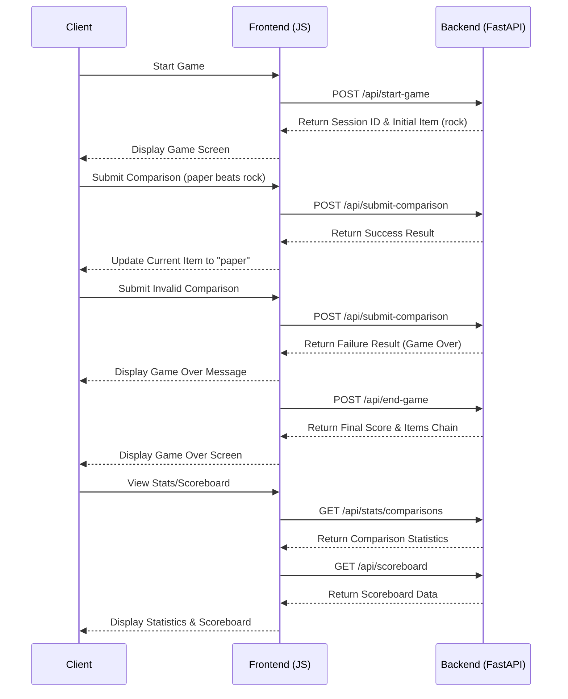

# WhatBeats Game Flow Sequence Diagram

This diagram illustrates the interactions between the Client (user/browser), Frontend (JavaScript), and Backend (FastAPI) during a typical game session in the WhatBeats application.

## Key Game Flow Steps

1. **Game Initialization**
   - User starts a new game
   - Backend creates a new game session with "rock" as the initial item
   - Frontend displays the game screen with the initial item

2. **Game Play**
   - User submits what they think beats the current item
   - Backend validates if the user's input beats the current item
   - If valid, the game continues with the user's input as the new current item
   - If invalid, the game ends

3. **Game End**
   - Frontend calls the backend to end the game
   - Backend finalizes the game session and saves high scores if applicable
   - Frontend displays the game over screen with final score and items chain

4. **Statistics & Scoreboard**
   - User can view comparison statistics and the scoreboard
   - Frontend fetches the relevant data from the backend
   - Frontend displays the statistics and scoreboard to the user